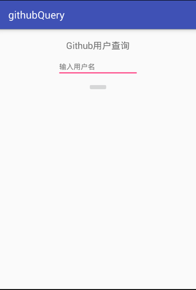
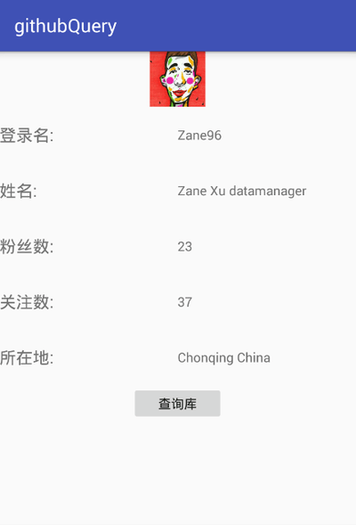
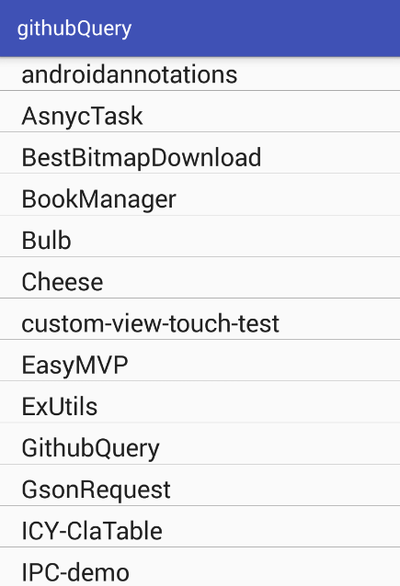

## GithubQuery
由rxjava+retrofit2+dagger2+mvp架构完成的查询github用户信息的app by android。

### 了解更多
app项目架构分析博客：[MVP中Model的进一步细化——DataManager](http://zane96.github.io/2016/03/01/MVP%E4%B8%ADModel%E7%9A%84%E8%BF%9B%E4%B8%80%E6%AD%A5%E7%BB%86%E5%8C%96%E2%80%94%E2%80%94DataManager/)

### 介绍
简单的练习了rxjava+retrofit2.0+dagger2+mvp架构项目。
+ Rxjava＋Retrofit+Okhttp结合做网络请求部分。Okhttp拦截请求头和响应头添加http缓存。
+ Dagger2用于模块解耦和依赖注入，这里主要在presenter中注入DataManager。
+ MVP模式架构项目。使用本人的一套MVP开发框架:EasyMVP。
+ DataManager用于管理数据源。提供唯一的数据源接口。详细介绍：[Android Application Architecture](https://labs.ribot.co.uk/android-application-architecture-8b6e34acda65#.l43i845f0)

### mvp框架——EasyMVP
[EasyMVP项目地址](https://github.com/Zane96/EasyMVP)，还在不断完善中。

### 样式

